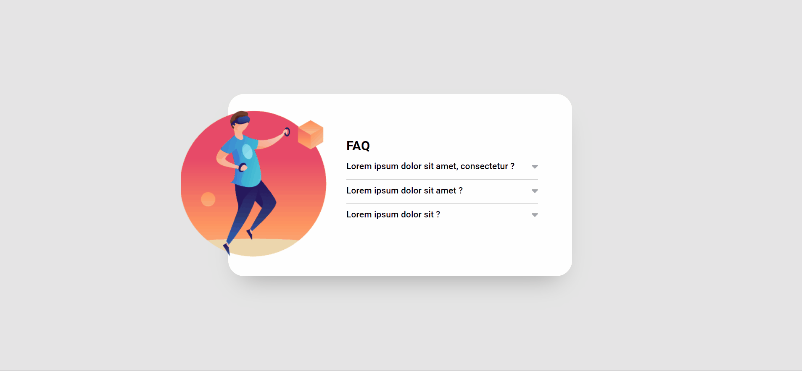

# DevQuest | Acordeon
Essa página é um FAQ de uma empresa fictícia, que ao clicar em uma pergunta deve acontecer uma animação de acordeon para abrir o item e mostrar o texto escondido, e a seta deve mudar de cor. Ao clicar em um item para abri-lo todos os outros itens devem ser fechados.

## Índice

- Design
- Links
- Tecnologias utilizadas

## Visão geral

### Design desktop 🖥️

## Links

- [DevQuest | Acordeon](https://erickf-silva.github.io/acordeon/)

## Tecnologias utilizadas

- HTML
- CSS
- JS
